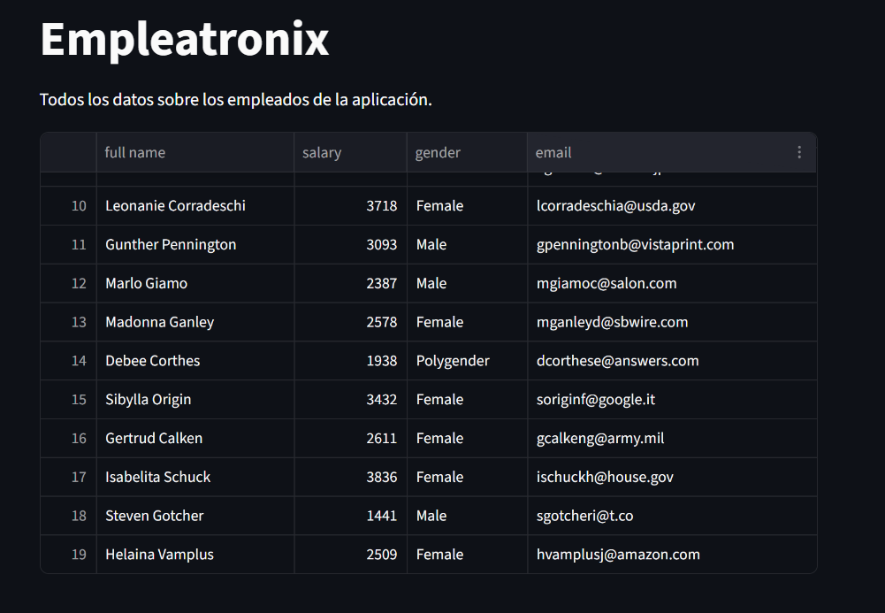
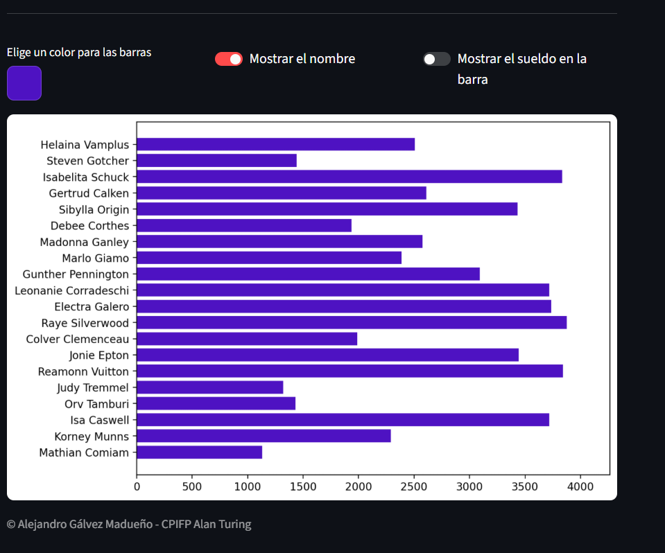

# Aplicación Empleatronix
### Ejercicio de práctica Streamlit

**Autor:** `Alejandro Gálvez`

# Descripción del proyecto

Este proyecto utiliza Streamlit, Pandas y Matplotlib para crear una aplicación web interactiva que visualiza y analiza datos de empleados. La aplicación permite:

* Visualización tabular: Muestra una tabla completa con todos los datos de los empleados cargados desde un archivo CSV.

* Gráficos interactivos: Genera un diagrama de barras horizontales que representa los salarios de los empleados.

* Personalización visual: Incluye controles interactivos para personalizar la apariencia del gráfico en tiempo real.

# Visualización 

[Web Desplegada](https://empleatronix-agalmad.streamlit.app/)

<div style="display: flex; flex-direction: column;">
  
  
</div>

# Instalación y ejecución

### Método 1: Ejecución local

1. Clonar o descargar el proyecto

```bash
git clone https://github.com/AGALMAD/empleatronix
```

2. Crear un entorno virtual (recomendado)

```bash
python -m venv venv
source venv/bin/activate  # En Windows: venv\Scripts\activate
```

3. Instalar dependencias

```bash
pip install -r requirements.txt
```

4. Ejecutar la aplicación

```bash
streamlit run streamlit_app.py
```

### Método 2: Usando Docker (recomendado)

```bash
docker compose build
docker compose up
```
